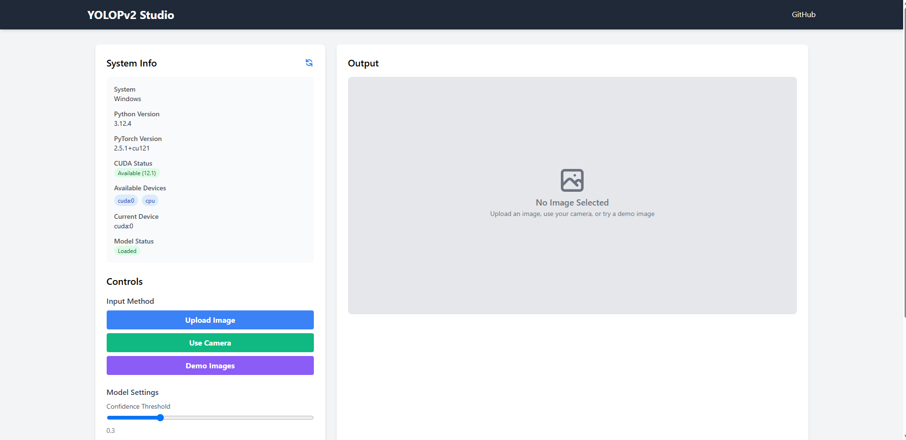
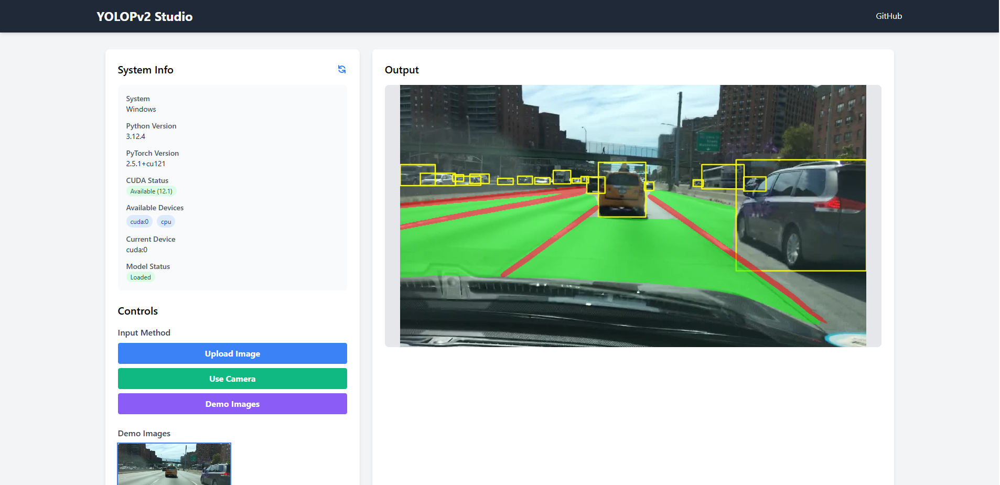
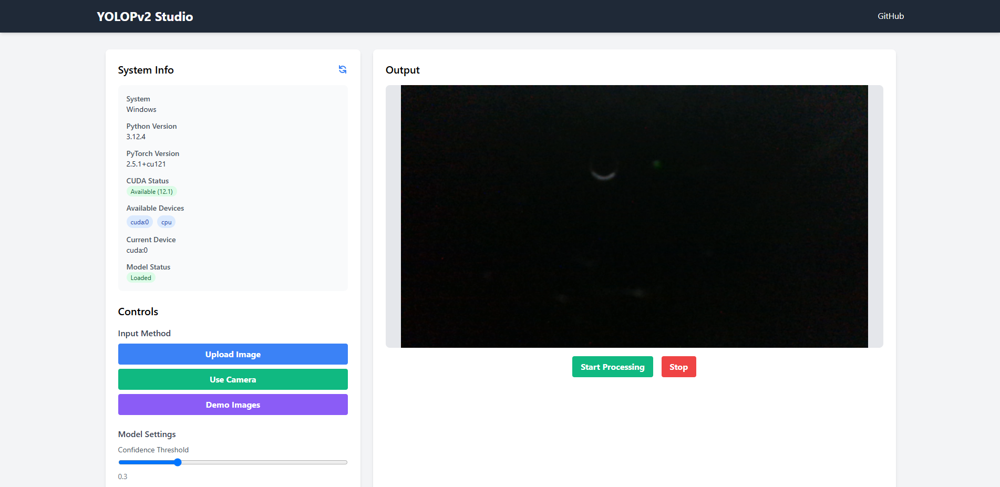
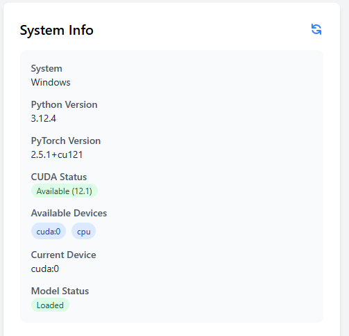

# YOLOPv2-Studio

A user-friendly studio environment for YOLOPv2 that enables easy model selection, media upload, and real-time camera processing. This tool makes advanced computer vision accessible with an intuitive interface for object detection, lane detection, and drivable area segmentation.

## Overview

YOLOPv2-Studio provides a web-based interface for the YOLOPv2 model, which performs:
- **Object Detection** (vehicles, pedestrians, etc.)
- **Lane Line Detection**
- **Drivable Area Segmentation**

All within a single unified model optimized for autonomous driving scenarios.

## Screenshots

Here are some screenshots showcasing the application's interface and capabilities:

### Main Dashboard
<!-- Add your main dashboard screenshot here -->


### Image Detection Results
<!-- Add your image detection results screenshot here -->


### Real-time Camera Processing
<!-- Add your camera processing screenshot here -->


### System Information Panel
<!-- Add your system info panel screenshot here -->


## Features

The web interface provides:

1. **Multiple Input Methods:**
   - Upload your own images
   - Use the example image from the `data/demo/` directory
   - Use a webcam for real-time detection

2. **Customizable Detection Options:**
   - Toggle object detection, drivable area, and lane detection
   - Adjust confidence and IoU thresholds
   - Real-time FPS counter for performance monitoring

3. **Cross-Platform Compatibility:**
   - Automatically runs on Windows, macOS, and Linux
   - Automatically detects and uses the best available hardware (CPU/GPU)
   - Downloads required model files if not available

## Setup Instructions

### For Windows Users

1. **Prerequisites:**
   - Install Python 3.8 or higher from [python.org](https://www.python.org/downloads/windows/)
   - Make sure to check "Add Python to PATH" during installation

2. **Installation Steps:**
   - Open Command Prompt (search for "cmd" in the start menu)
   - Run these commands:

   ```bat
   :: Clone the repository
   git clone https://github.com/usamakhangt4/YOLOPv2-Studio.git
   cd YOLOPv2-Studio

   :: Create virtual environment
   python -m venv studio-env
   studio-env\Scripts\activate

   :: Install dependencies
   pip install -r requirements.txt
   ```

3. **Running the Application:**
   ```bat
   python app/main.py
   ```

4. Open your browser and navigate to: http://localhost:8080

### For macOS Users

1. **Prerequisites:**
   - Install Python using Homebrew (recommended) or from [python.org](https://www.python.org/downloads/macos/)
   
   ```bash
   # Install Homebrew if not already installed
   /bin/bash -c "$(curl -fsSL https://raw.githubusercontent.com/Homebrew/install/HEAD/install.sh)"
   
   # Install Python
   brew install python
   ```

2. **Installation Steps:**
   - Open Terminal
   - Run these commands:

   ```bash
   # Clone the repository
   git clone https://github.com/usamakhangt4/YOLOPv2-Studio.git
   cd YOLOPv2-Studio

   # Create virtual environment
   python3 -m venv studio-env
   source studio-env/bin/activate

   # Install dependencies
   pip install -r requirements.txt
   ```

3. **Running the Application:**
   ```bash
   python app/main.py
   ```

4. Open your browser and navigate to: http://localhost:8080

### For Linux Users

1. **Prerequisites:**
   - Most Linux distributions come with Python pre-installed
   - If not, install Python using your package manager:
   
   ```bash
   # For Ubuntu/Debian
   sudo apt update
   sudo apt install python3 python3-pip python3-venv

   # For Fedora
   sudo dnf install python3 python3-pip
   ```

2. **Installation Steps:**
   - Open Terminal
   - Run these commands:

   ```bash
   # Clone the repository
   git clone https://github.com/usamakhangt4/YOLOPv2-Studio.git
   cd YOLOPv2-Studio

   # Create virtual environment
   python3 -m venv studio-env
   source studio-env/bin/activate

   # Install dependencies
   pip install -r requirements.txt
   ```

3. **Running the Application:**
   ```bash
   python app/main.py
   ```

4. Open your browser and navigate to: http://localhost:8080

## First Time Setup Notes

When you run the application for the first time:

1. **Automatic Model Download:**
   - The application will automatically download the YOLOPv2 model if it's not already present
   - This might take a few minutes depending on your internet connection
   - The model is approximately 150MB in size

2. **System Detection:**
   - The application automatically detects your operating system
   - It selects the best device (CPU/GPU) for running the model
   - You can view and change these settings via the System Info panel

3. **Troubleshooting Common Issues:**
   
   - **If the application fails to start:**
     - Check that you activated the virtual environment
     - Ensure all dependencies were installed correctly
   
   - **If the model fails to load:**
     - Check your internet connection for the automatic download
     - You can manually download the model from [this link](https://github.com/CAIC-AD/YOLOPv2/releases/download/V0.0.1/yolopv2.pt) and place it in the `data/weights/` directory

   - **If the camera doesn't work:**
     - Make sure your browser has permission to access your camera
     - Try a different browser if issues persist

## Using the Application

1. **Starting the Application:**
   - Launch the application using the command appropriate for your OS
   - Open your web browser and navigate to http://localhost:8080

2. **Selecting Input Source:**
   - **Upload Image:** Click "Choose File" and select an image from your computer
   - **Demo Image:** Click the "Try Demo Image" button
   - **Camera:** Click "Start Camera" to use your webcam

3. **Adjusting Settings:**
   - Use the toggles to enable/disable detection features
   - Adjust the confidence threshold slider to filter detections
   - The FPS counter shows real-time performance metrics

4. **Working with Results:**
   - View detection boxes, lane lines, and drivable areas
   - For camera mode, click "Start Processing" to begin analysis
   - Click "Stop Processing" when done

## Project Structure

The application has been restructured for better organization and maintainability:

```
YOLOPv2-Studio/
├── app/                      # Application directory
│   ├── config/               # Configuration files
│   │   ├── __init__.py       # Package initialization
│   │   └── settings.py       # Application settings
│   ├── models/               # Model-related code
│   │   ├── __init__.py       # Package initialization
│   │   └── model_loader.py   # Model loading and management
│   ├── modules/              # Additional functional modules
│   │   └── __init__.py       # Package initialization
│   ├── routes/               # API and web route handlers
│   │   ├── __init__.py       # Package initialization
│   │   ├── api.py            # API endpoints
│   │   └── web.py            # Web page routes
│   ├── static/               # Static assets
│   │   ├── css/              # CSS stylesheets
│   │   ├── js/               # JavaScript files
│   │   └── images/           # App images and icons
│   ├── templates/            # HTML templates
│   │   └── index.html        # Main application page
│   ├── utils_app/            # Utility functions
│   │   ├── __init__.py       # Package initialization
│   │   └── image_processing.py # Image processing utilities
│   ├── app.py                # Legacy app file (for reference)
│   └── main.py               # Application entry point
├── data/                     # Data directory
│   ├── demo/                 # Demo images and videos
│   │   └── example.jpg       # Example image for testing
│   └── weights/              # Model weights directory
│       └── yolopv2.pt        # YOLOPv2 model weights (auto-downloaded)
├── requirements.txt          # Python dependencies
├── LICENSE                   # MIT License
└── README.md                 # Project documentation
```

## License

Based on [YOLOPv2](https://github.com/CAIC-AD/YOLOPv2) developed by CAIC-AD.

MIT License - © 2025 Muhammad Usama Bin Akhtar Khan.

